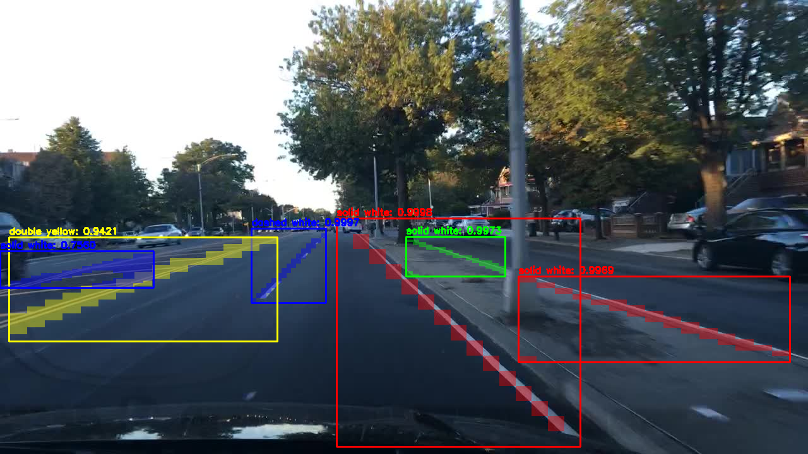
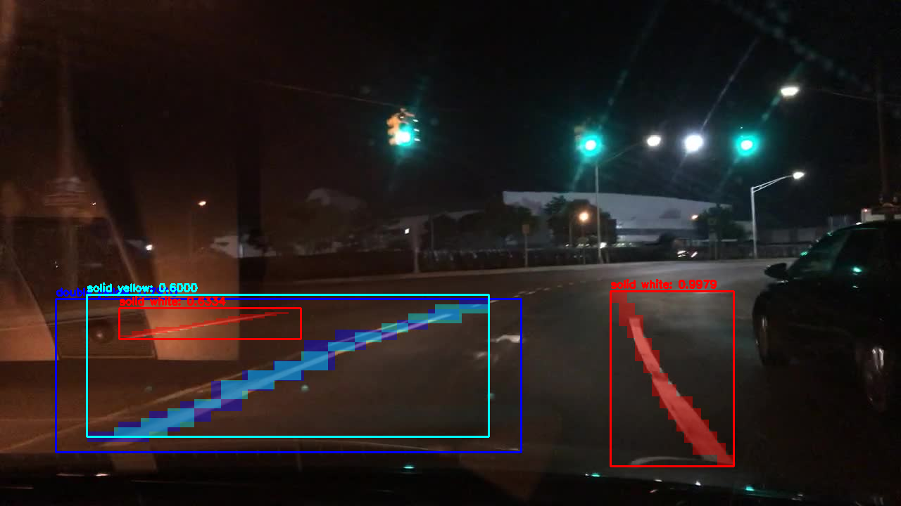

This project detects 7 classes of lane marking, including single dashed yellow line, single solid yellow line, double solid yellow line, single dashed white line, single solid white line, double solid white line and cross walk.

two mask r-cnn models were trained: one is inception_v2 as backbone, the other is mobilenet_v1 as backbone

I trained with 500+ images for 50000 steps.Sample output:

